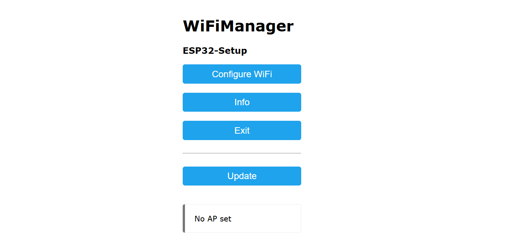
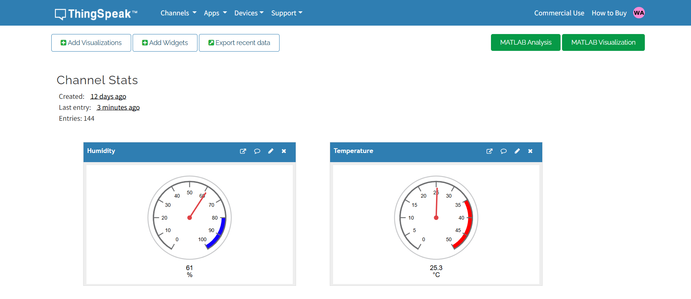
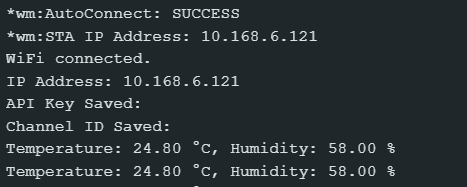

# ESP32 DHT11 ThingSpeak Uploader

This project uses an ESP32 microcontroller to read temperature and humidity data from a DHT11 sensor and send the data to ThingSpeak over WiFi. WiFiManager is used to simplify the WiFi and ThingSpeak configuration process via a browser portal.

---

## Project Objective

- Read temperature and humidity using the DHT11 sensor.
- Connect to WiFi using WiFiManager with a captive portal.
- Collect user-defined ThingSpeak API Key and Channel ID.
- Send the sensor data to ThingSpeak every 3 seconds.
- Store and retrieve credentials using Preferences storage on the ESP32.
- Indicate status via an onboard LED.

---

## Technologies Used

- ESP32 microcontroller
- DHT11 temperature and humidity sensor
- ThingSpeak API for IoT data visualization
- WiFiManager for configuration without hardcoding credentials
- Preferences library for non-volatile storage
- HTTPClient for sending HTTP GET requests
- Arduino IDE or PlatformIO

---

## How to Run the Project

### Hardware Requirements

- ESP32 development board
- DHT11 sensor
- Jumper wires
- Breadboard (optional)

### Software Requirements

- Arduino IDE (or PlatformIO)
- ESP32 board definitions installed via the Board Manager
- Required libraries:
  - WiFiManager
  - DHT sensor library
  - Adafruit Unified Sensor
  - Preferences
  - HTTPClient

### Wiring Instructions

| Component     | ESP32 Pin |
|---------------|-----------|
| DHT11 Data    | GPIO 12   |
| VCC (Power)   | 3.3V      |
| GND (Ground)  | GND       |

### Getting Your ThingSpeak API Key and Channel ID

1. Go to [https://thingspeak.com](https://thingspeak.com) and create a free account.
2. Once logged in, click on **"Channels"** in the top navigation bar.
3. Click **"New Channel"** and fill in the required details:
   - Name your channel (e.g., "ESP32 Sensor Data")
   - Enable at least **Field 1** and **Field 2** for temperature and humidity
4. Click **"Save Channel"**

#### Get Your Channel ID
- After saving, your **Channel ID** will be shown at the top of the channel page.

#### Get Your Write API Key
- Go to the **"API Keys"** tab in your channel.
- Copy the **Write API Key** — this is what your ESP32 uses to upload data.

### Setup Steps

1. Install all required libraries in the Arduino IDE.
2. Connect the ESP32 to your computer.
3. Upload the provided code to the ESP32.
4. After booting, the ESP32 creates a WiFi access point named `ESP32-Setup` with password `12345678`.
5. Connect to that access point using a phone or computer.
6. The WiFiManager portal will open:
   - Enter your WiFi credentials.
   - Enter your ThingSpeak API Key and Channel ID.
7. The ESP32 will restart and connect to your WiFi.
8. Sensor data will be read and sent to ThingSpeak every 3 seconds.
9. Open the Serial Monitor (115200 baud) to view live debug output.

---

## Screenshots

### WiFiManager Configuration Portal

The ESP32 starts in Access Point mode and opens a web-based configuration portal. Below are two screenshots showing the setup screens:

**1. WiFi Credentials Page**

This page allows you to select and connect to your home WiFi network.

**2. Custom Parameters Input (API Key and Channel ID)**

After selecting a network, you can enter your ThingSpeak API Key and Channel ID.

---

### ThingSpeak Channel Output

The ESP32 sends temperature and humidity data every 3 seconds. Below is a sample of the ThingSpeak dashboard showing real-time data visualization.

---

### Serial Monitor Output

The serial monitor shows the ESP32’s debug output, including connection status, IP address, sensor readings, and HTTP response from ThingSpeak.

---

## License

This project is licensed under the MIT License. You are free to use, modify, and distribute it.

---

## Questions or Feedback?

If you have questions or feedback, feel free to open an issue or contact the project maintainer.
